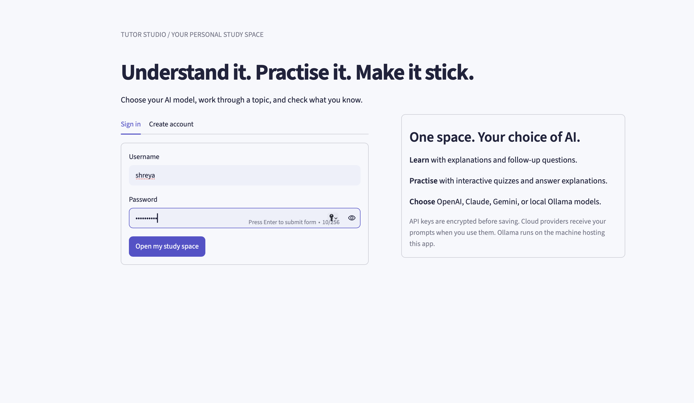
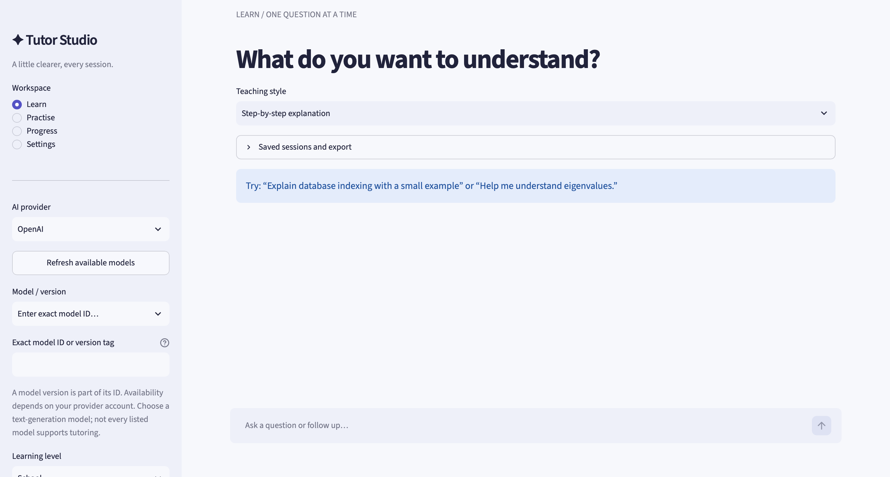
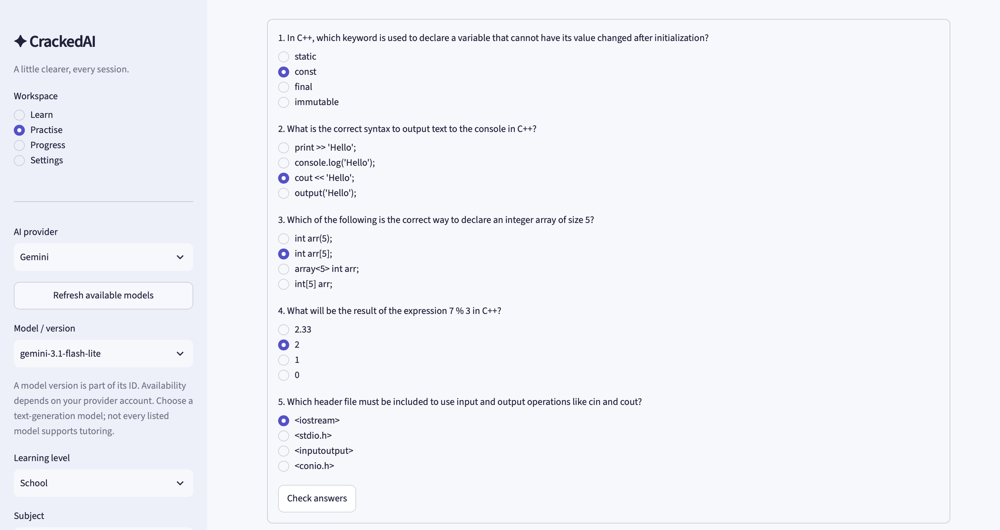
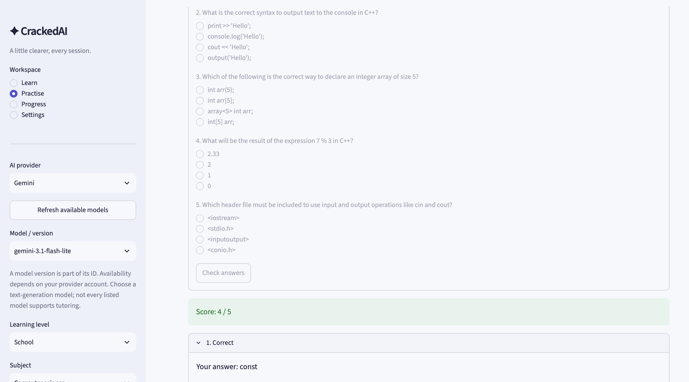
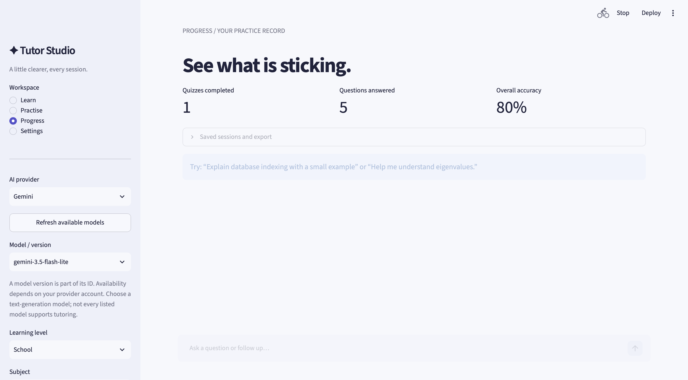
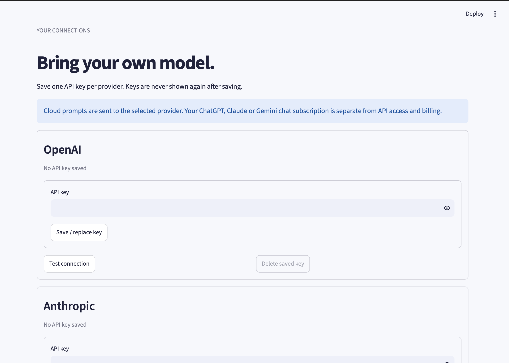

# CrackedAI

An AI study app for understanding concepts, practising questions, and tracking quiz performance. Choose your AI provider and model, connect your own API key, and study through explanations, follow-up conversations, and interactive quizzes.

## What it does

### Learn through conversation

Ask about a topic and continue with follow-up questions. Set your subject and learning level, then choose how you want the tutor to respond: step-by-step explanations, Socratic questions, concise revision notes, or worked examples.

Conversations can be saved, reopened, and downloaded as Markdown.

### Practise with generated quizzes

Enter a topic and generate 3–10 multiple-choice questions. Submit your answers to see your score and explanations, then use the results to decide what to revise. Generated quizzes can also be exported as JSON.

### Track your progress

Review previous quiz attempts and overall accuracy in the Progress view. Export your practice record as CSV to keep a separate study log.

### Choose your provider and model

CrackedAI supports OpenAI, Anthropic Claude, Google Gemini, and local Ollama models. Refresh the available model list or enter an exact model ID to use a specific provider-supported version or Ollama tag.

Each account can save, replace, test, and delete its own provider API keys through Settings. Cloud providers use your own API access; Ollama uses models installed on the app host.

## Screenshots

<!-- Add your screenshots to assets/screenshots/ using the filenames below. These are image placeholders, not included screenshots. -->

### Login

Create an account or sign in to access your saved study sessions and provider settings.




### Learn

Work through a topic with explanations and follow-up questions.



### Practise

Choose a quiz topic and the number of questions to generate.


### Quiz

Answer multiple-choice questions and review your score and explanations after submission.




### Progress

Review your quiz history and overall accuracy.



## How it works

1. Create an account and sign in.
2. Open **Settings** and save your API key, or start Ollama on the app host.
3. Select an **AI provider**, click **Refresh available models**, and choose a **Model / version**.

4. Set your subject and learning level.
5. Use **Learn** for explanations, **Practise** for quizzes, and **Progress** to review your results.

Model versions are part of their IDs. The available choices depend on your provider account or installed Ollama models. Choose a text-generation model supported by the app's provider adapter.

## Tech stack

| Component | Technology |
| --- | --- |
| Application and interface | Python, Streamlit |
| AI integration | Provider REST APIs through requests |
| Account and study data | SQLite |
| Password verification | Salted scrypt hashes |
| API-key encryption | Fernet with password-derived keys |
| Container setup | Docker, Docker Compose |
| Tests | Python unittest and Streamlit AppTest |

## Run locally

Use **Python 3.11 or newer**; Python 3.12 is recommended. Run these commands from the project folder containing `app.py`.

### macOS / Linux

```bash
python3.12 -m venv .venv
.venv/bin/python -m pip install -r requirements.txt
.venv/bin/python -m streamlit run app.py
```

### Windows / PowerShell

```powershell
py -3.12 -m venv .venv
.\.venv\Scripts\python.exe -m pip install -r requirements.txt
.\.venv\Scripts\python.exe -m streamlit run app.py
```

Open [http://localhost:8501](http://localhost:8501).

### Docker

```bash
docker compose up --build
```

Open the same local URL. The included Compose setup stores application data in the `tutor-data` volume.

## Data and API keys

Accounts, saved conversations, and quiz records are stored in SQLite. API keys are encrypted before storage and unlocked using a key derived from the account password. Conversations and quiz records are not encrypted in the database.

Enter API keys through **Settings**. Keep the `data/` directory, environment files, and credentials out of Git. Hosted deployments need persistent storage to retain accounts and study history across restarts.

The current app is intended for local use and small trusted demos. See [SECURITY.md](SECURITY.md) for authentication limitations and public deployment requirements.

## Project structure

| File | Purpose |
| --- | --- |
| `app.py` | Login, settings, learning, quizzes, and progress screens |
| `tutor/providers.py` | AI requests and model discovery |
| `tutor/learning.py` | Tutoring prompts, conversation limits, and quiz validation |
| `tutor/store.py` | Account-scoped database operations |
| `tutor/security.py` | Password verification and API-key encryption |
| `tests/` | Core functionality and interface tests |
| `assets/screenshots/` | README screenshots |
| `Dockerfile`, `compose.yaml` | Container setup |
| `ARCHITECTURE.md` | Application design and request flow |
| `SECURITY.md` | Security protections and deployment limitations |

## Testing

```bash
.venv/bin/python -m unittest discover -s tests -v
```

On Windows, use `.\.venv\Scripts\python.exe` instead. Tests cover account isolation, encrypted key storage, quiz validation and scoring, provider requests, and interface flows. Provider calls in the test suite are mocked.

## Inspiration

Inspired by the tutoring and quiz workflow in [hari7261/AI-Tutor](https://github.com/hari7261/AI-Tutor). CrackedAI adds provider and model selection, per-account API-key storage, saved conversations, and practice tracking.
